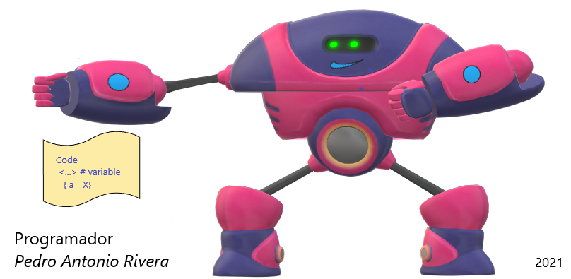

Incialmente desarrollaba aplicaciones cliente Servidor con bases de datos MS Access, FoxPro 9, con codigo Visual Studio y motor SQL Server.
Los cambios Tecnológicos de TI nos llevaron a incursionar con aplicaciones WEB, colocando en Internet la capa de presentación,
La capa logica en el equipos del Usuario, y la capa de Datos en los servidores de Datos con Azure SQL Database en la Nube privada. 

Trabajo en la Oficina Planeacion como Gestor de proyectos en una Entidad del Estado.

### Pertenecia y Competencias Técnicas.

- 😄 Estoy trabajando en el Proyecto <a href="https://softterier.github.io/Protopito-PGN/">Patrimonio</a>  
- 🔭 Aplicación Tetodologia PMI para el inicio, seguimiento, desarrollo y entrega de proyectos.
- 📝 Documentación: Manual Técnico Proyecto, Manual de Usuario, Diagramas UML, Casos de USO, Sure Step. 
- 📫 Habilidades Blandas en Governance TI - Cobit, PMP, SCAMPI - CMMI, Agile, Kanban.
- 🌱 Practica y aprendizaje en la creacion paginas Web con formularios de captura de datos.
- 💼 Conocimientos de Visual Basic / HTML / CSS / PHP / C# / Visual.net / SharePoint / SQL Server / MySQL
- 🤔 Adaptar los sistemas a las plataformas de SaaS, PaaS, IaaS en la Nube.
- 💬 Crear Experimentos de Analitica. BI y algoritmos con Machine Learning.
- 😄 Propositos: Analista de Datos BI, BigData, Power BI.
- 👯 Incurcionar ampliamante en Lenguajes de Programacion Java, Phyton, C#.
- ⚡ Crecer como Programador Full Stack, trabajar con Github, Git, Visual Studio Code.
- 👋 Gestor del Sistema de Gestión de la Calidad iso 9001:2015. Apoyo en los Procesos de la Empresa.

